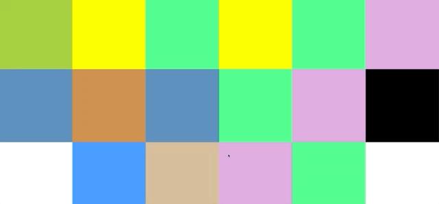
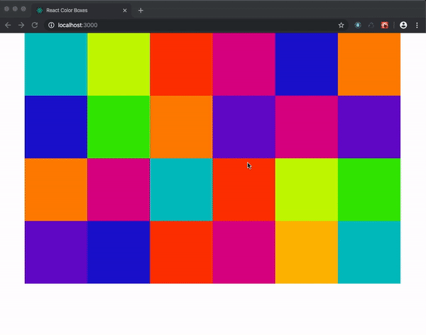

# react-colorboxes
An exercise to reenforce understanding React props, defaultProps, state, and simple click events in React.

#### The Goal

For this project, it should show a series of 18 boxes (a box is just square div with a background color).

Initially, each box should have a background color chosen from a random list of colors.

When boxes are clicked, it should change its color to a different random color.

Here’s some inspiration:

## My Finished Project

##### What I Learned

I learned that I could directly style the component with inline styling with JSX. A helpers.js file helps clean up code with reuseable functions, in this case a random array selector. Also I understand the issue with trying to pass an onClick event to the child component and see how there has to be a better method to handle this. 

:thumbsup: *Thanks for checking out my work on GitHub! For more about me find me on Twitter @TyeDev or vist my personal website at www.TyeCampbell.com.*
